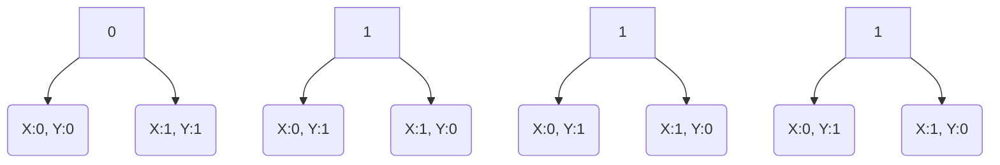
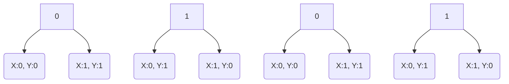

> FOREWORD: 
> Due to working on this whilst being pressed for time, I do not consider this editorial to be up to the standards I have set in the previous contests I've been editor-in-chief of. If there are any explanations here that feel inadequate, feel free to reach out any of the organisers for clarifications. 
> 
> For the same reason, this editorial does not contain the solutions to the problems under the 'Hard' label. 


## Toh chaliye shuru karte hai


The core problem here seems simple- given an integer `A`, we need to find the its largest divisor (excluding the number itself).

The obvious approach might seem to be to run a `for` loop from `2`  to `n`, check if the iterator `i` divides `A` perfectly or not, and store it in a variable. However, the constraints are such that a program with time complexity O(n) or more will exceed the time limit. Hence, we iterate the loop only upto _the square root of `A`,_ because the maximum divisor of a  number N will always be greater than its square root (**unless** the number is prime). This logic will work in `O(sqrt(n))` and hence will pass for the given constraints.

Code:
```cpp
// Code written by Vikash Sangai

#include<bits/stdc++.h>
#define int long long
#define endl "\n"
#define FastIO ios_base::sync_with_stdio(false); cin.tie(NULL);
using namespace std;

void solve()
{
    int n;
    cin>>n;
    int ans=1; //accounting for prime numbers
    for(int i=2;i*i<=n;i++)
    {
        if(n%i==0)
        {
	        //this is used instead of the simple assignment so as to reduce the number of rewrites ans will need
            ans=max(ans, n/i);
        }
    }
    cout<<ans<<endl;
}

signed main(){
    FastIO;
    int t=1;
    cin>>t;
    for(int i=1;i<=t;i++)
    {
        solve();
    }
    return 0;
}
```


## ED hai toh mumkin hai


This problem has constraints lenient enough that it can be brute forced. The code is pretty self-explanatory and there really is no real twist to this problem- just going through every element present in the array and checking if they're divisible by the length of the array works.

```cpp
//Code written by Anupam Ghosh

#include <cmath>
#include <cstdio>
#include <vector>
#include <iostream>
#include <algorithm>
using namespace std;

bool isBeautiful(vector<int> x,int n){
    for(int i=0;i<n;i++)
    {
        if(x[i]%n)
        {
	        return 0;
	    }
    }
    return 1;
}
int main() {
    int n;
    cin>>n;
    vector<int> x;
    for(int i=0;i<n;i++)
    {
        int t;
        cin>>t;
        x.push_back(t);
        
    }
    if(isBeautiful(x,n))
    {
	    cout<<"Beautiful";
    }
    else
	    {
		    cout<<"Not Beautiful";
		}
    
    return 0;
}
```

## Maths exam abhi baaki hai


Looking past the intimidating nomenclature of bit manipulation problems (seriously though, it can't be _only_ me that gets anxiety reading the word "setbit"), the course of action for this problem can be visualised easily with a few examples:

1. N = 15 (`1111`)

Even though 16 (`10000`) seems closer to 15, we need to change 5 bits to convert 15 to 16- which is quite high. The trick here is to **look for the power of 2 with the same number of significant bits as N.** _The number of significant bits_ refers to the minimum number of bits needed to represent a number, for example, 15 needs a minimum of 4 bits for its binary representation, so its number of significant bits is 4. Now, _why_ this is so is because you only need to change a maximum of `n-1` bits for a number with `n` significant bits.

Thus, for 15, the power of 2 with the same number of significant bits is 8 (`1000`). We need to change 3 bits in 15 from 1 to 0 to get 8:

1~~111~~ -> 1**000**
Hence, the answer here would be 3.

2. N = 5 (`101`)

Applying the same logic here, we need to convert 5 to 4 (`100`)

10~~1~~ -> 10**0**
Hence, the answer here is 1.


Implementing this logic is simple- we count the number of `1`'s in the binary representation of `N` and display that number minus 1 (to account for the first significant bit not changing)


Now that the core logic has been deduced, a couple of edge cases need to be looked out for.

- _Edgecase for 0:_
	With no bits getting flipped, our code would end up returning -1 for 0 if not accounted for.

- _Size of input:_
	Note that the size of inputs goes upto 10<sup>15</sup>: **greater than the size limit for the integer data type.** Using a bigger data type like `long long` would make more sense here. The same issue will arise if builtin functions like `__builtin_popcount()` are used- they expect `int` as input, nad hence would result in an overflow error.


Code: (disclaimer- the countbits() implementation used here uses something ridiculous called the **Brian Kernighan’s Algorithm**- [this](https://www.geeksforgeeks.org/count-set-bits-in-an-integer/) article from geeksforgeeks explains it (and other ways to count bits) well, but you don't need to understand that for this problem (trust me, I didn't understand this very well either, just remembered this formula as the counting-bits-method), so the inner workings of this function can be ignored for the most part.)
```cpp
//Code written by Siddharth Banerjee

#include <iostream>
#include <cmath>

using namespace std;

int countbits(long long n) // errors might arise due to __builtin_popcpount() only taking int
{
	int TrueBits = 0;
	while(n>0)
	{
		n&=(n-1); // black magic
		TrueBits++;
	}
	return TrueBits;
}


int main()
{
	int t;
	long long n;
	cin >> t;
	for(int i = 0;i<t;i++)
	{
		cin >> n;
		//edgecase for 0
		if(n == 0)
			cout << 1 << "\n";
		else
			cout << countbits(n)-1 << "\n";
	}
	return 0;
}

```

## Salary kitna loge


The premise of the problem seems simple- find the maximum number whose factorial has a given number of trailing zeroes. Before delving into any logic, there are two observations that must be made:

1. _**The maximum possible value of N is 10<sup>12</sup>.**_ 
	Thus, approaches with time complexity being O(n) or more will not be feasible.

2. _**There are values of N for which there exists no number having a factorial with that number of trailing zeroes.**_ 
	While doing mathematics involving factorials, it should be notes that the number of trailing zeroes depends on the number of multiples of 5 present. For example, `17!`  has 3 trailing zeroes, because it contains 3 multiples of 5. 
	
	Hence, in theory, the number of trailing zeroes goes up with the number of multiples 5 has. However, this approach has to be slightly modified to include  **exponents of 5:** for example, `29!` has 5 multiples of 5, but one of them (25) is divisible by 5 twice, and hence `29!` is divisible by 5 six times and will have 6 trailing zeroes instead of 5. Thus, there are **no numbers with a factorial having 5 trailing zeroes**. Hence, multiples of 25 also need to be accounted for, and the same goes for other mulitples of exponents of 5 too.
	
	There is a good read on finding the number of trailing zeroes in the factorial of a number by [Brilliant.org](https://brilliant.org/wiki/trailing-number-of-zeros/), and the formula that is used to find this out is as follows:
	 
	  $$f(n) = \sum_{i=1}^k \Bigg[\frac{n}{5^i}\Bigg]$$
	  where$$ k = \log_5 n$$

Now that we know how to find the number of trailing zeroes of a number, we need to find a way to reach the largest number with a given number of trailing zeroes. Since we cannot search for that number linearly, we apply **binary search** to find it, by assuming the upper and lower bounds to be the constraints themselves. Since this has a time complexity of _O(log(N))_, it fits within our constraints. 

Code: 
```cpp
//Code written by Vikash Sangai
#include<bits/stdc++.h>
#define int long long
#define endl "\n"

using namespace std;

int check(int n) // finding number of trailing zeroes- implementation of the formula given
{
    int count=0;
    for(int i=5;i<=n;i*=5)
    {
        count+=n/i;
    }
    return count;
}

void solve() // applying binary search to find the largest number that match the requirements
{
    int n;
    cin>>n;
    int low=1, high=1e18;
    int ans=-1;
    while(low<=high)
    {
        int mid=(low+(high-low)/2);
        int val=check(mid);
        if(val==n)
        {
            ans=max(ans,mid);
            low=mid+1;
        }
        else if(val>n)
        {
            high=mid-1;
        }
        else
        {
            low=mid+1;
        }
    }
    cout<<ans<<endl;
}

signed main()
{
    int t=1;
    cin>>t;
    for(int i=1;i<=t;i++)
    {
        solve();
    }
    return 0;
}
```

## Ka!bhi 6 Kabhi 9


This problem would be a little easier to visualise if we read the string as a binary one. We can do so by replacing all the `6`'s with `1`'s and  `9`'s with `0`'s respectively. 

Now, onto the question- we have been asked to find the minimum number of moves required to convert a binary string into another binary string where no _subsequences_ of the form `101` or `010` are present.


> What is a subsequence? 
> A subsequence of a given sequence is a sequence that can be derived from the given sequence by deleting some or no elements without changing the order of the remaining elements. 
> 
> For example,  `101` is a subsequence of `11011`, because if we delete bits from `11011` as shown:
>  1~~1~~ 0~~1~~1
>  We get `101`.

Therefore, we need to obtain a string where **there are no alternating bits present anywhere.** This cuts down the possible number of final strings we can obtain to the following 4:
1. `111...11000...0`
2. `000...00111...1`
3. `000...0`
4. `111...1`

Case 3 and 4 are covered as special cases of 1 and 2, and hence need not be accounted for seperately.

Thus, the new problem now is **to find the minimum number of moves to convert the given string into any of the 2 aforementioned forms.** To do this, we find out the total number of `1`'s and `0`'s present in the string, then iterate through the string maintaining an count of `1`'s and `0`'s encountered in the string upto the current position of the iterator, say `i`, and use them to calculate the number of changes we would need to make to convert the string to any of the two forms (with the point of change being the `i`<sup>th</sup> bit), and take the minimum between them.

This logic is best understood by an example. Say the string we take is `6699696`. 

On converting this to `1`'s and `0`'s, we get `1100101`. The total number of `1`'s here are 4 (stored in a variable, say `total1`), and the number of `0`'s is 3 (stored in say `total0`).

Now, coming to how we can find out the minimum number of moves to reach the 2 cases, we need to mantain counts of the number of `1`'s and `0`'s encountered until the `i`<sup>th</sup> index, say using variables `cur1` and `cur0` respectively. Thus, to convert the given string into form 1 with the point of change being the `i`<sup>th</sup> index, we would need to add the number of `0`'s we've already encountered (since we would need to change them all to `1`) and the number of `1`'s present in the string after `i` (because they'd need to be converted to `0`). Thus, the formula to obtain that expression would be:  ==**(cur1 + total0-cur0)**==. The approach for form 2 is similar. Thus, if we check for each `i` in the given binary string,

i | i<sup>th</sup> bit | number of `0`'s encountered (`cur0`) | number of `1`'s encountered (`cur1`) |  (`cur1`  + `total0-cur0`) | (`cur0` + `total1-cur1`) | minimum
--|---------|--------------------------------|---------------------------------|---------------|------|---
0 | 1 | 0 | 1 | 1+3-0 = 4 | 0+4-1 = 3 | 3
1 | 1 | 0 | 2 | 2+3-0 = 5 | 0+4-2 = 2 | 2
2 | 0 | 1 | 2 | 2+3-1 = 4 | 1+4-2 = 3 | 2 (neither smaller than previous minimum)
3 | 0 | 2 | 2 | 2+3-2 = 3 | 2+4-2 = 4 | 2
4 | 1 | 2 | 3 | 3+3-2 = 4 | 2+4-3 = 3 | 2 
5 | 0 | 3 | 3 | 3+3-3 = 3 | 3+4-3 = 4 | 2
6 | 1 | 3 | 4 | 4+3-3 = 4 | 3+4-4 = 3 | 2

Thus, the minimum number of moves needed is **2**.

Code:
```cpp
//Code written by Upayan De, modified by Siddharth Banerjee for Editorial purposes
#include <bits/stdc++.h>
using namespace std;

void solve() {
    int n; 
    cin >> n; 
    string s; 
    cin >> s;
    int ans = INT_MAX;
    int cnt6 , cnt9 , cur6 , cur9;
    cnt6 = cnt9 = 0;
    for (int i = 0 ; i < n ; i++) 
    {
        if (s[i] == '6') 
        {
            cnt6++;
        } 
        else 
        {
            cnt9++;
        }
    }
    cur6 = cur9 = 0;
    for (int i = 0 ; i < n ; i++) 
    {
        if (s[i] == '6') 
        {
            cur6++; 
        } 
        else 
        {
            cur9++;
        }
        int cost1 = cur9 + (cnt6 - cur6); //cost to convert to a 99...966...6 pattern
        int cost2 = cur6 + (cnt9 - cur9); //cost to convert to a 66...699...9 pattern
        ans = min({ans , cost1, cost2});     //finding minmum number of moves among the 2 costs and the old answer
    }
    cout << ans << "\n";
}

signed main() 
{
    int tt = 1; 
    cin >> tt;
    for (int i = 1 ; i <= tt ; i++) {
        solve();
    }
    return 0;
}
```

## Telegram University aspirant


Despite the rather verbose nature of the question, there is a simple and elegant one-size-fits-all solution to this problem.


Again, this is best explained with an example.

1.  7 (`111`)

The problem has asked us to consider one extra power of 2 than the next greater power of 2, i.e. , the number can be represented with **an extra bit after the first significant bit.** Thus, the number is respresented as `0111`.

Now, we've been asked to find 2 positive integers whose XOR will give us 7.  Hence, we use the number itself as a starting point.

What exactly are we doing when we perform a XOR operation between two numbers? We check if the two bits at a particular position are different (result is `1`) or not (result is `0`). Therefore, this problem devolves into a simple problem from the fundamental principle of counting (yes, that concept from permutations and combinations), because there are only 2 ways of obtaining a particular bit by XORing two different bits.


 There are 2 cases arising for each bit. Thus, the the total number of unique pairs of (x,y) can be created here are **2 X 2 X 2 X 2  =  16** (becaue (x,y) is counted seperately from (y,x)). Note the constraints though- the minimum possible value `x` or `y` can take is 1, so we need to discard the cases where either `x` or `y` is 0. There will be exactly 2 such cases (one where `x` is 0, and one where `y` is). Therefore, the number of valid pairs we have is **16 - 2  =  14**. This matches the testcase too.

2. 5 (`101`)

7 will be represented as `0101`.



Applying a similar logic here: the number of valid pairs we have is **2 X 2 X 2 X 2  -  2   =   14**.


There is a peculiar observation to be made here: **the value of individual bits does not change the number of valid pairs**: the number of pairs depends on the number of significant bits the number has, not its value. This discovery allows us to generalise this logic as a simple formula to find the number of significant bits present in the number, and return a function of that number- one which is pretty self-explanatory when seen in the code.

Code:

```cpp
//Code written by Siddharth Banerjee

#include <iostream>
#include <cmath>

using namespace std;

int main()
{
	int t;
	long long n; // grade A idiot here, declared this as int in my wrong test submission
	cin >> t;
	for(int i = 0;i<t;i++)
	{

		cin >> n;
		long long noofbits = (long long)log2(n)+2; // the number of significant bits + 1
		cout << (long long)(pow(2,noofbits)-2) << "\n"; //the number of valid pairs
	}
	return 0;
}
```


## Credits

**Head Organizer, Problem Setter and Beta Tester:** Vikash Sangai, IT 2021-25

**Problem setter and Beta Tester:** Anupam Ghosh, IT 2021-25

**Beta Tester and Editor-in-chief:** Siddharth Banerjee, IT 2021-25

**Problem Setter:** Mainak Seal, EE 2021-25

**Special thanks to:** Upayan De, CSE 2021-25


